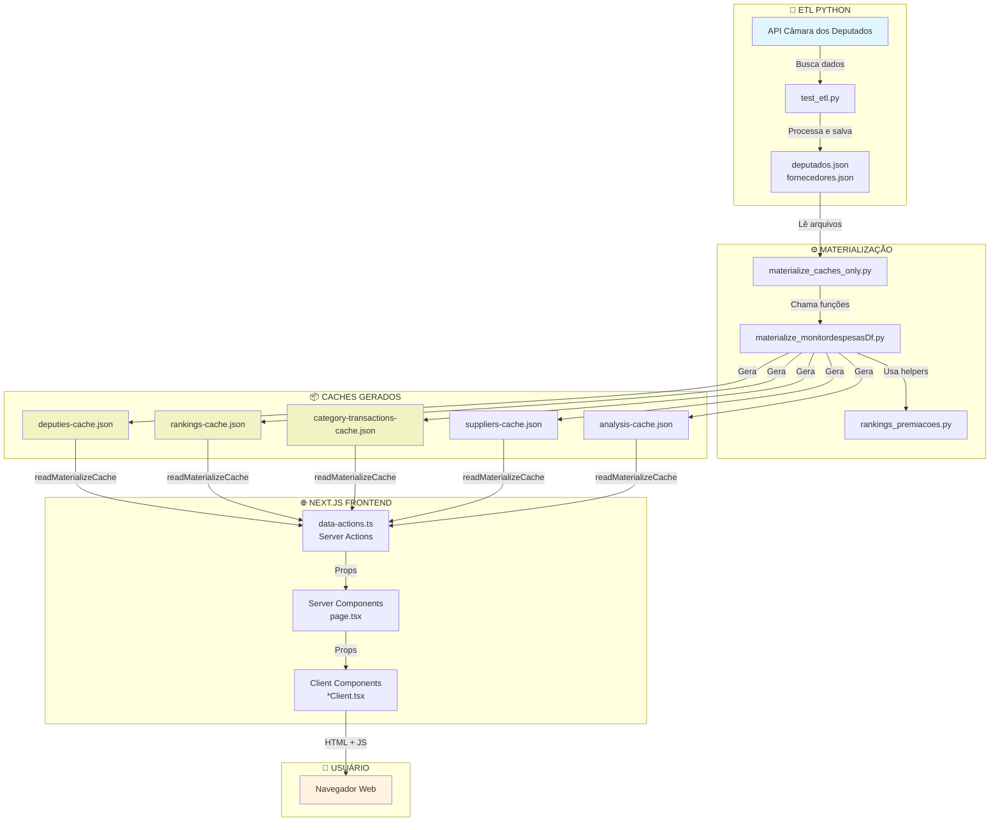

# Fluxo Completo: Da Materialização ao Frontend

**Objetivo:** Entender como os dados fluem desde a materialização Python até aparecerem na tela do usuário.

---

## 📚 Índice

1. [Visão Geral do Pipeline](#visão-geral-do-pipeline)
2. [Etapa 1: Materialização (Python ETL)](#etapa-1-materialização-python-etl)
3. [Etapa 2: Geração dos Caches](#etapa-2-geração-dos-caches)
4. [Etapa 3: Consumo no Frontend (Next.js)](#etapa-3-consumo-no-frontend-nextjs)
5. [Etapa 4: Renderização na UI](#etapa-4-renderização-na-ui)
6. [Tipos de Caches Gerados](#tipos-de-caches-gerados)
7. [Fluxos de Dados Específicos](#fluxos-de-dados-específicos)

---

## Visão Geral do Pipeline



---

## Etapa 1: Materialização (Python ETL)

### 🎯 Objetivo
Transformar dados brutos em caches JSON otimizados para o frontend.

### 📁 Arquivo Principal
`packages/etlpython/materialize_caches_only.py`

### 🔄 Processo

```python
# 1. ENTRADA: Encontrar arquivos de dados
project_root = find_project_root(Path.cwd())

default_deps = project_root / "bancoDados/monitordespesas/congressoNacional/camaraDeputados/deputadosFederais/deputados.json"
default_forns = project_root / "bancoDados/monitordespesas/congressoNacional/fornecedores/fornecedores.json"

# 2. CARREGAR: Ler JSONs brutos
raw_deputados = load_dataset(deputados_dataset_path)
# Retorna: Lista de dicionários Python
# [
#   {"id": "220538", "nome": "Albuquerque", "partido": "REPUBLICANOS", ...},
#   {"id": "220714", "nome": "Adail Filho", ...},
#   ...
# ]

raw_fornecedores = load_dataset(fornecedores_dataset_path)

# 3. NORMALIZAR: Padronizar estrutura
normalized_deputados = normalize_deputados(raw_deputados)
# Retorna: Lista de objetos NormalizedDeputado
# [
#   NormalizedDeputado(id="220538", nome="Albuquerque", partido="REPUBLICANOS", ...),
#   NormalizedDeputado(id="220714", nome="Adail Filho", ...),
#   ...
# ]

normalized_fornecedores = normalize_fornecedores(raw_fornecedores)

# 4. GERAR CACHES: Criar arquivos otimizados
generate_frontend_caches(
    normalized_fornecedores,
    normalized_deputados,
    fornecedores_dataset_path,
    deputados_dataset_path,
    project_root,
    legislatura=57,
    version="v2",
    dados_processados=None,
    deputados_index={},
)
```

### 📊 Fluxo Visual da Materialização

```
┌─────────────────────────────────────────┐
│  deputados.json (Arquivo de Entrada)   │
│  ┌─────────────────────────────────┐   │
│  │ [{                              │   │
│  │   "id": "220538",               │   │
│  │   "nome": "Albuquerque",        │   │
│  │   "partido": "REPUBLICANOS",    │   │
│  │   "total_despesas": 1627454.45  │   │
│  │ }, ...]                         │   │
│  └─────────────────────────────────┘   │
└─────────────────────────────────────────┘
              ↓
┌─────────────────────────────────────────┐
│      load_dataset(deputados.json)       │
│  Lê arquivo e converte para Python     │
└─────────────────────────────────────────┘
              ↓
┌─────────────────────────────────────────┐
│    normalize_deputados(raw_deputados)   │
│  ┌─────────────────────────────────┐   │
│  │ Para cada deputado:             │   │
│  │ - Extrai campos-chave           │   │
│  │ - Padroniza nomenclatura        │   │
│  │ - Valida tipos de dados         │   │
│  │ - Cria objeto NormalizedDeputado│   │
│  └─────────────────────────────────┘   │
└─────────────────────────────────────────┘
              ↓
┌─────────────────────────────────────────┐
│         generate_frontend_caches        │
│  Cria múltiplos caches especializados   │
└─────────────────────────────────────────┘
```

---

## Etapa 2: Geração dos Caches

### 🏭 Arquivo de Trabalho
`packages/etlpython/src/etlpython/cli/materialize_monitordespesasDf.py`

### 📦 Caches Gerados

A função `generate_frontend_caches` cria **7 caches principais**:

```python
def generate_frontend_caches(...):
    cache_dir = project_root / "packages/monitor-despesas-next/public/cache"
    
    # 1. CACHE DE FORNECEDORES
    suppliers_cache = build_suppliers_cache(
        normalized_fornecedores,
        fornecedores_dataset_path,
        legislatura=57,
        version="v2"
    )
    
    # 2. CACHE DE DEPUTADOS
    deputies_cache = build_deputies_cache(
        normalized_deputados,
        deputados_dataset_path,
        legislatura=57,
        version="v2"
    )
    
    # 3. CACHE DE ALERTAS
    normalized_alertas = generate_alertas(normalized_deputados, normalized_fornecedores)
    alerts_cache = build_alerts_cache(normalized_alertas, ...)
    
    # 4. CACHE DE PREMIAÇÕES
    premiacoes_cache = build_premiacoes_cache(
        generate_premiacoes(normalized_deputados), ...
    )
    
    # 5. CACHE DE ANÁLISES
    analysis_cache = build_analysis_cache(
        normalized_deputados, 
        normalized_alertas, 
        ...
    )
    
    # 6. CACHE DE CATEGORIAS (SIMPLES)
    categories_cache = build_categories_cache(
        normalized_fornecedores, ...
    )
    
    # 7. CACHE DE CATEGORIAS POR TRANSAÇÃO
    category_transactions_cache = build_category_transactions_cache(
        categorias_resumo, ...
    )
    
    # 8. CACHE DE RANKINGS
    rankings_deputados = gerar_rankings_deputados(normalized_deputados, dados_processados)
    rankings_cache = {
        "metadata": {...},
        "data": {
            "deputados": {
                "rankings": rankings_deputados,
                "premiacoes": premiacoes_deputados
            }
        }
    }
    
    # ESCREVER ARQUIVOS
    caches = {
        "suppliers-cache.json": suppliers_cache,
        "deputies-cache.json": deputies_cache,
        "alerts-cache.json": alerts_cache,
        "premiacoes-cache.json": premiacoes_cache,
        "rankings-cache.json": rankings_cache,
        "analysis-cache.json": analysis_cache,
        "categories-cache.json": categories_cache,
        "category-transactions-cache.json": category_transactions_cache,
    }
    
    for filename, content in caches.items():
        path = cache_dir / filename
        with open(path, "w") as f:
            json.dump(content, f, indent=2)
```

### 🗂️ Estrutura de um Cache

Todos os caches seguem o mesmo padrão:

```json
{
  "metadata": {
    "generatedAt": "2025-11-08T13:42:14Z",
    "source": "etlpython-materialize",
    "version": "v2",
    "legislatura": 57,
    "totalXXX": 123
  },
  "data": [
    // Array de objetos OU
    // Objeto com estrutura específica
  ]
}
```

---

## Etapa 3: Consumo no Frontend (Next.js)

### 🌐 Arquitetura Next.js

```
┌─────────────────────────────────────────────────────┐
│                 NEXT.JS APP ROUTER                  │
├─────────────────────────────────────────────────────┤
│                                                     │
│  ┌───────────────────────────────────────────┐    │
│  │  SERVER COMPONENTS (page.tsx)             │    │
│  │  - Executam no servidor                   │    │
│  │  - Podem chamar Server Actions            │    │
│  │  - Fazem SSR (Server-Side Rendering)      │    │
│  └───────────────────────────────────────────┘    │
│                      ↓                              │
│  ┌───────────────────────────────────────────┐    │
│  │  SERVER ACTIONS (data-actions.ts)         │    │
│  │  - 'use server' no topo do arquivo        │    │
│  │  - Leem arquivos do sistema               │    │
│  │  - Processam dados                        │    │
│  │  - Retornam apenas o necessário           │    │
│  └───────────────────────────────────────────┘    │
│                      ↓                              │
│  ┌───────────────────────────────────────────┐    │
│  │  CLIENT COMPONENTS (*Client.tsx)          │    │
│  │  - 'use client' no topo do arquivo        │    │
│  │  - Recebem dados via props                │    │
│  │  - Gerenciam interatividade               │    │
│  │  - Executam no navegador                  │    │
│  └───────────────────────────────────────────┘    │
│                                                     │
└─────────────────────────────────────────────────────┘
```

### 📂 Estrutura de Pastas

```
packages/monitor-despesas-next/
├── public/
│   └── cache/                          # ← Caches gerados pelo Python
│       ├── deputies-cache.json
│       ├── rankings-cache.json
│       ├── category-transactions-cache.json
│       └── ...
│
└── src/
    └── app/
        └── gastos/
            ├── actions/
            │   └── data-actions.ts     # ← SERVER ACTIONS
            │
            └── premiacoes/
                ├── page.tsx            # ← SERVER COMPONENT
                └── PremiacoesPageClient.tsx  # ← CLIENT COMPONENT
```

### 🔧 Server Actions (data-actions.ts)

**Linha 1:** `'use server'` - Marca o arquivo como servidor

**Função de Leitura de Cache:**

```typescript
// Linha ~150
const readMaterializeCache = cache(async <T>(cacheName: string): Promise<T> => {
  // 1. Monta o caminho do arquivo
  const sourcePath = join(PUBLIC_CACHE_ROOT, `${cacheName}.json`)
  // PUBLIC_CACHE_ROOT = "packages/monitor-despesas-next/public/cache"
  
  // 2. Lê o arquivo do sistema de arquivos
  const data = await readFile(sourcePath, 'utf-8')
  // ⚠️ Isso SÓ funciona no servidor! Navegador não tem acesso ao sistema de arquivos
  
  // 3. Converte JSON string → objeto JavaScript
  return JSON.parse(data)
})
```

**Exemplo de Server Action - getPremiacoes():**

```typescript
// Linha ~1025
export async function getPremiacoes(filters: {
  ano?: string
  categoria?: string
  uf?: string
}): Promise<PremiacoesData> {
  
  // PASSO 1: Carregar cache de rankings
  const rankingsRaw = await readMaterializeCache<unknown>('rankings-cache')
  const rankingsData = parseRankingsCache(rankingsRaw)
  
  // PASSO 2: Extrair rankings específicos
  const rankingsGeral = rankingsData.deputados?.rankings?.geral || []
  const rankingsPorAno = rankingsData.deputados?.rankings?.porAno || {}
  
  // PASSO 3: Carregar cache de categorias
  const categoryCacheRaw = await readMaterializeCache<unknown>('category-transactions-cache')
  const categoryCache = parseCategoriesCache(categoryCacheRaw)
  
  // PASSO 4: Criar Map de deputados para enriquecimento
  const deputadosMap = new Map(
    rankingsGeral.map((dep: any) => [
      String(dep.id),
      {
        id: dep.id,
        nome: dep.nome || `Deputado ID ${dep.id}`,
        partido: dep.partido || 'N/I',
        uf: dep.uf || 'N/I',
      }
    ])
  )
  
  // PASSO 5: Processar categorias e enriquecer com dados completos
  Object.entries(categoryCache.categorias).forEach(([catName, catData]) => {
    if (catData.topDeputados) {
      rankingsPorCategoria[catName] = catData.topDeputados.map((dep: any) => {
        const deputadoCompleto = deputadosMap.get(dep.id)
        
        return {
          id: dep.id,
          nome: deputadoCompleto?.nome || `Deputado ID ${dep.id}`,
          partido: deputadoCompleto?.partido || 'N/I',
          uf: deputadoCompleto?.uf || 'N/I',
          totalDespesas: dep.totalGasto || 0,
          numeroDespesas: dep.transacoes || 0,
        }
      })
    }
  })
  
  // PASSO 6: Aplicar filtros
  let rankingsFiltrados = []
  
  if (categoria && categoria !== 'TODAS') {
    rankingsFiltrados = rankingsPorCategoria[categoria] || []
  } else if (ano && ano !== 'todos') {
    rankingsFiltrados = rankingsPorAno[ano] || []
  } else {
    rankingsFiltrados = rankingsGeral
  }
  
  // PASSO 7: Retornar dados processados
  return {
    rankingsFiltrados: rankingsFiltrados.slice(0, 200),
    estatisticas: {...},
    metadata: {...}
  }
}
```

### 🖥️ Server Component (page.tsx)

```typescript
// src/app/gastos/premiacoes/page.tsx

// Recebe parâmetros da URL
type PremiacoesPageProps = {
  searchParams: {
    ano?: string
    categoria?: string
    uf?: string
  }
}

export default async function PremiacoesPage({ searchParams }: PremiacoesPageProps) {
  // PASSO 1: Chamar Server Action (executa no servidor)
  const data = await getPremiacoes({
    ano: searchParams.ano,
    categoria: searchParams.categoria,
    uf: searchParams.uf
  })
  
  // PASSO 2: Renderizar Client Component passando dados via props
  return (
    <PremiacoesPageClient
      initialData={data}
      filters={{
        ano: searchParams.ano || 'todos',
        categoria: searchParams.categoria || 'TODAS',
        uf: searchParams.uf || 'TODAS'
      }}
    />
  )
}
```

**⚠️ Importante:**
- Server Component executa **APENAS no servidor**
- Pode fazer operações pesadas (ler arquivos, banco de dados)
- Usuário não vê o código deste componente
- Envia apenas HTML renderizado para o navegador

### 💻 Client Component (*Client.tsx)

```typescript
// src/app/gastos/premiacoes/PremiacoesPageClient.tsx

'use client'  // ← Marca como Client Component

import { useState } from 'react'

export default function PremiacoesPageClient({ initialData, filters }) {
  // PASSO 1: Estado local (só existe no navegador)
  const [deputadosExibidos, setDeputadosExibidos] = useState(50)
  
  // PASSO 2: Manipuladores de eventos
  const handleVerMais = () => {
    setDeputadosExibidos(prev => Math.min(prev + 50, 200))
  }
  
  // PASSO 3: Renderização interativa
  return (
    <div>
      <h1>Premiações</h1>
      
      {/* Lista de deputados */}
      {initialData.rankingsFiltrados.slice(0, deputadosExibidos).map((dep, idx) => (
        <div key={dep.id}>
          <span>{idx + 1}º {dep.nome}</span>
          <span>{dep.partido} • {dep.uf}</span>
          <span>R$ {dep.totalDespesas.toLocaleString()}</span>
        </div>
      ))}
      
      {/* Botão interativo */}
      {deputadosExibidos < initialData.rankingsFiltrados.length && (
        <button onClick={handleVerMais}>
          Ver mais +50
        </button>
      )}
    </div>
  )
}
```

**⚠️ Importante:**
- Client Component executa **no navegador**
- Pode usar hooks do React (useState, useEffect, etc.)
- Recebe dados apenas via props (não pode ler arquivos)
- Código é enviado para o navegador (visível no DevTools)

---

## Etapa 4: Renderização na UI

### 🌊 Fluxo Completo de uma Requisição

```
1. USUÁRIO digita URL
   http://localhost:3000/gastos/premiacoes?categoria=SERVIÇOS+POSTAIS
   
   ↓

2. NEXT.JS identifica rota
   app/gastos/premiacoes/page.tsx
   
   ↓

3. SERVER COMPONENT executa
   - Extrai searchParams: { categoria: "SERVIÇOS POSTAIS" }
   - Chama getPremiacoes({ categoria: "SERVIÇOS POSTAIS" })
   
   ↓

4. SERVER ACTION executa
   - Lê rankings-cache.json
   - Lê category-transactions-cache.json
   - Filtra por categoria
   - Enriquece com dados completos
   - Retorna { rankingsFiltrados: [...], metadata: {...} }
   
   ↓

5. SERVER COMPONENT renderiza
   - Recebe dados do Server Action
   - Renderiza PremiacoesPageClient com initialData
   - Gera HTML no servidor
   
   ↓

6. NAVEGADOR recebe
   - HTML já renderizado (SSR)
   - JavaScript do Client Component
   - Dados embutidos no HTML (hidratação)
   
   ↓

7. CLIENT COMPONENT hidrata
   - React "reconstrói" o estado no navegador
   - Adiciona event listeners (onClick, onChange, etc.)
   - Interface se torna interativa
   
   ↓

8. USUÁRIO interage
   - Clica em "Ver mais +50"
   - Estado local atualiza (deputadosExibidos: 50 → 100)
   - React re-renderiza apenas a parte afetada
```

### 🎨 Timeline Visual

```
Tempo →
━━━━━━━━━━━━━━━━━━━━━━━━━━━━━━━━━━━━━━━━━━━━━━━━━━━━━━━━━━━

SERVIDOR:
  0ms   ├─ Usuário acessa URL
  10ms  ├─ Next.js identifica rota
  20ms  ├─ Server Component inicia
  30ms  ├─ getPremiacoes() lê rankings-cache.json
  50ms  ├─ getPremiacoes() lê category-transactions-cache.json
  70ms  ├─ Processa e filtra dados
  80ms  ├─ Retorna dados para Server Component
  90ms  ├─ Server Component renderiza HTML
  100ms └─ Envia HTML + JS para navegador

REDE:
  100ms ├─ Transferência HTTP (HTML + JS + CSS)
  250ms └─ Navegador recebe tudo

NAVEGADOR:
  250ms ├─ Parse HTML
  260ms ├─ Carrega React
  280ms ├─ Hidratação do Client Component
  300ms ├─ Página totalmente interativa ✅
        │
  [usuário clica "Ver mais"]
        │
  5000ms ├─ handleVerMais() executa
  5001ms ├─ setState() atualiza deputadosExibidos
  5010ms └─ React re-renderiza (apenas a lista)
```

---

## Tipos de Caches Gerados

### 1. deputies-cache.json

**Propósito:** Lista completa de deputados com dados básicos

**Estrutura:**
```json
{
  "metadata": {
    "totalDeputados": 18,
    "legislatura": 57
  },
  "data": [
    {
      "id": "220538",
      "nome": "Albuquerque",
      "partido": "REPUBLICANOS",
      "uf": "RR",
      "totalDespesas": 1627454.45,
      "numeroDespesas": 594,
      "gastosPorAno": {...},
      "topCategorias": [...]
    }
  ]
}
```

**Usado em:**
- Listagem de deputados
- Detalhes de deputado individual
- Busca de deputados

### 2. rankings-cache.json

**Propósito:** Rankings pré-calculados (geral, por ano, por UF)

**Estrutura:**
```json
{
  "metadata": {...},
  "data": {
    "deputados": {
      "rankings": {
        "geral": [
          {"posicao": 1, "id": "220538", "nome": "Albuquerque", ...}
        ],
        "porAno": {
          "2023": [...],
          "2024": [...]
        },
        "porUf": {
          "SP": [...],
          "RJ": [...]
        }
      },
      "premiacoes": {...}
    }
  }
}
```

**Usado em:**
- Página de premiações (rankings)
- Home page (top deputados)
- Filtros por ano/UF

### 3. category-transactions-cache.json

**Propósito:** Transações agrupadas por categoria de despesa

**Estrutura:**
```json
{
  "metadata": {...},
  "data": {
    "categorias": [
      {
        "categoria": "SERVIÇOS POSTAIS",
        "totalGasto": 2714.83,
        "totalTransacoes": 16,
        "anos": {
          "2023": {"valor": 1500, "transacoes": 10},
          "2024": {"valor": 1214.83, "transacoes": 6}
        },
        "topDeputados": [
          {
            "id": "220638",
            "nome": "",  // ⚠️ Vazio! (problema)
            "totalGasto": 1130.70,
            "transacoes": 5
          }
        ]
      }
    ]
  }
}
```

**Usado em:**
- Página de premiações (filtro por categoria)
- Análise de categorias de despesa

### 4. suppliers-cache.json

**Propósito:** Lista de fornecedores e suas transações

**Usado em:**
- Listagem de fornecedores
- Detalhes de fornecedor
- Busca de fornecedores

### 5. analysis-cache.json

**Propósito:** Métricas pré-calculadas para dashboards

**Usado em:**
- Dashboard principal
- Gráficos e visualizações

---

## Fluxos de Dados Específicos

### Fluxo 1: Listar Deputados

```
Usuário acessa /gastos/deputados
    ↓
page.tsx (Server Component)
    ↓
getDeputados() (Server Action)
    ├─ readMaterializeCache('deputies-cache')
    ├─ parseDeputiesCache(cacheRaw)
    ├─ Aplica filtros (busca, ordenação)
    └─ Retorna { deputados: [...], total: 18 }
    ↓
page.tsx renderiza DeputadosClient
    ↓
DeputadosClient.tsx (Client Component)
    ├─ Recebe deputados via props
    ├─ Renderiza tabela/cards
    └─ Adiciona interatividade (busca, paginação)
    ↓
Usuário vê lista na tela
```

### Fluxo 2: Filtrar Premiações por Categoria

```
Usuário seleciona categoria "SERVIÇOS POSTAIS"
    ↓
onChange do <Select> executa
    ↓
Client Component atualiza URL
    router.push('?categoria=SERVIÇOS+POSTAIS')
    ↓
Next.js recarrega página com novo searchParams
    ↓
page.tsx (Server Component)
    ↓
getPremiacoes({ categoria: "SERVIÇOS POSTAIS" })
    ├─ Lê rankings-cache.json
    ├─ Lê category-transactions-cache.json
    ├─ Busca topDeputados da categoria
    ├─ Enriquece com dados do rankingsGeral
    └─ Retorna { rankingsFiltrados: [6 deputados] }
    ↓
page.tsx renderiza PremiacoesClient
    ↓
PremiacoesClient exibe 6 deputados
```

### Fluxo 3: Ver Mais Deputados (Paginação)

```
Usuário clica "Ver mais +50"
    ↓
onClick executa handleVerMais()
    ↓
setState atualiza deputadosExibidos: 50 → 100
    ↓
React re-renderiza componente
    ├─ Calcula slice(0, 100)
    └─ Renderiza 50 deputados adicionais
    ↓
⚠️ NENHUMA requisição ao servidor!
⚠️ Dados já estavam em initialData
```

---

## 🎯 Resumo Executivo

### 1. Python Materializa
- Lê `deputados.json` + `fornecedores.json`
- Normaliza dados
- Gera 7+ caches especializados em `public/cache/`

### 2. Next.js Server Actions
- Leem caches do sistema de arquivos
- Processam e filtram dados
- Retornam apenas o necessário

### 3. Server Components
- Chamam Server Actions
- Renderizam HTML no servidor
- Passam dados para Client Components

### 4. Client Components
- Recebem dados via props
- Gerenciam interatividade
- Re-renderizam no navegador

### 5. Usuário
- Vê página carregada rapidamente (SSR)
- Interage sem recarregar (CSR)
- Experiência fluida

---

## 🔑 Conceitos-Chave

### Server-Side Rendering (SSR)
- HTML gerado no servidor
- Usuário vê conteúdo imediatamente
- SEO-friendly

### Client-Side Rendering (CSR)
- Interações acontecem no navegador
- Sem recarregar página
- Rápido e responsivo

### Hydration
- React "hidrata" HTML estático
- Adiciona event listeners
- Torna página interativa

### Caching
- Dados pré-processados
- Respostas rápidas
- Menor carga no servidor

---

**Documentação criada em:** 8 de novembro de 2025  
**Autor:** GitHub Copilot  
**Última atualização:** 8 de novembro de 2025
