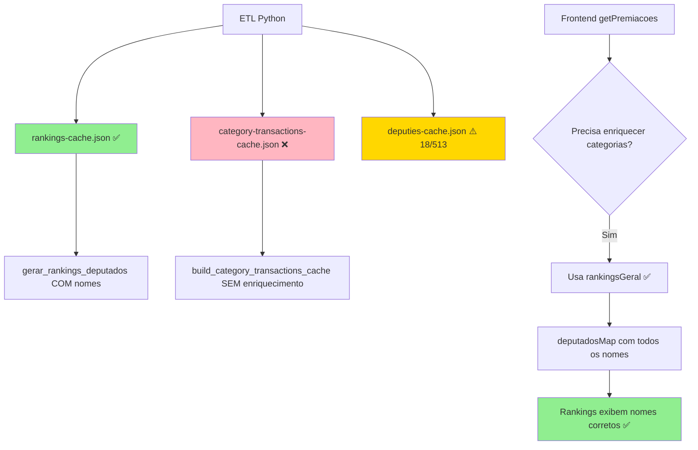
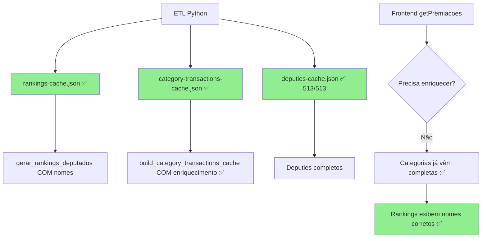

# Bug: Nomes Ausentes nos Rankings por Categoria

**Status:** ✅ Corrigido no Frontend | ⚠️ Correção Pendente no ETL Python  
**Severidade:** Média  
**Data de Identificação:** 8 de novembro de 2025  
**Impacto:** Rankings por categoria exibiam "Nome não disponível" para 495 de 513 deputados

---

## 📋 Sumário Executivo

Os rankings de deputados por categoria (ex: "SERVIÇOS POSTAIS", "DIVULGAÇÃO DA ATIVIDADE PARLAMENTAR") estavam exibindo apenas IDs numéricos ao invés de nomes, partidos e UFs dos deputados. A investigação revelou uma inconsistência entre dois caches gerados pelo ETL Python:

- **`rankings-cache.json`**: Contém dados completos (nome, partido, UF) ✅
- **`category-transactions-cache.json`**: Contém apenas IDs, com campos vazios ❌

---

## 🔍 Manifestação do Problema

### Tela do Usuário (Antes da Correção)

```
Top 6 Deputados • SERVIÇOS POSTAIS
Exibindo 6 de 6 deputados conforme filtros aplicados.

1º Nome não disponível
N/I • N/I • 5 despesas
R$ 1.130,70

2º Nome não disponível
N/I • N/I • 5 despesas
R$ 768,55

3º Nome não disponível
N/I • N/I • 3 despesas
R$ 359,10
```

### Comportamento Esperado

```
Top 6 Deputados • SERVIÇOS POSTAIS

1º Deputado XYZ
REPUBLICANOS • SP • 5 despesas
R$ 1.130,70

2º Deputado ABC
PT • RJ • 5 despesas
R$ 768,55
```

---

## 🐛 Análise da Causa Raiz

### 1. Estrutura dos Caches Gerados pelo ETL

#### `rankings-cache.json` (✅ Correto)
```json
{
  "data": {
    "deputados": {
      "rankings": {
        "geral": [
          {
            "id": "220538",
            "nome": "Albuquerque",      // ✅ TEM NOME
            "partido": "REPUBLICANOS",   // ✅ TEM PARTIDO
            "uf": "RR"                   // ✅ TEM UF
          }
        ]
      }
    }
  }
}
```

#### `category-transactions-cache.json` (❌ Problema)
```json
{
  "data": {
    "categorias": [
      {
        "categoria": "SERVIÇOS POSTAIS",
        "topDeputados": [
          {
            "id": "220638",
            "nome": "",                  // ❌ VAZIO
            "siglaPartido": null,        // ❌ NULL
            "siglaUf": null             // ❌ NULL
          }
        ]
      }
    ]
  }
}
```

### 2. Código Python Responsável

**Arquivo:** `packages/etlpython/src/etlpython/cli/materialize_monitordespesasDf.py`

**Função Problemática (Linha 1411):**
```python
def build_category_transactions_cache(
    categorias_resumo: Dict[str, Any],
    *,
    legislatura: int,
    version: str
) -> Dict[str, Any]:
    # ...
    for categoria, dados in categorias_resumo.items():
        categorias_payload.append({
            "categoria": categoria,
            "totalGasto": round(dados.get('totalGasto', 0), 2),
            "totalTransacoes": dados.get('totalTransacoes', 0),
            "anos": dados.get('anos', {}),
            "topDeputados": dados.get('deputados', [])[:50],  # ❌ SEM ENRIQUECIMENTO
        })
```

**Comparação com Função que Funciona (Linha 1441):**
```python
def build_supplier_relationships_cache(
    fornecedores_enrichment: Dict[str, Any],
    *,
    legislatura: int,
    version: str,
    deputados_info: Optional[Dict[str, Any]] = None  # ✅ Recebe info
) -> Dict[str, Any]:
    # ...
    for chave, dados in fornecedores_enrichment.items():
        deputados_enriquecidos = _enrich_deputados_collection(  # ✅ ENRIQUECE
            dados.get('deputados', []), 
            deputados_info
        )[:100]
```

### 3. Estado do `deputies-cache.json`

Investigação adicional revelou que o cache de deputados estava incompleto:

```bash
# Total de deputados no cache
$ Get-Content deputies-cache.json | ConvertFrom-Json | Select-Object -ExpandProperty data | Measure-Object
Count: 18  # ❌ Deveria ter ~513 deputados da legislatura 57!
```

**Causa:** ETL foi executado com limite:
```bash
python run_etl.py 57 18  # ← Limitou a apenas 18 deputados
```

---

## ✅ Soluções Implementadas

### Solução Imediata (Frontend - TypeScript)

**Arquivo:** `packages/monitor-despesas-next/src/app/gastos/actions/data-actions.ts`  
**Linha:** ~1058

#### Antes (Problemático)
```typescript
const deputadosDataset = await getDeputadosDataset()  // Só tem 18 deputados
const deputadosMap = new Map(
  deputadosDataset.deputados.map(dep => [dep.id, dep])
)
// Resultado: 495 deputados não encontrados
```

#### Depois (Solução)
```typescript
// Usar rankings-cache que JÁ TEM todos os nomes!
const deputadosMap = new Map(
  rankingsGeral.map((dep: any) => [
    String(dep.id),
    {
      id: dep.id,
      nome: dep.nome || `Deputado ID ${dep.id}`,
      partido: dep.partido || 'N/I',
      uf: dep.uf || 'N/I',
    }
  ])
)
```

**Vantagens:**
- ✅ Resolve imediatamente o problema
- ✅ `rankingsGeral` já está carregado na função
- ✅ Contém todos os deputados com dados completos
- ✅ Não requer regeneração dos caches Python

**Limitações:**
- ⚠️ Workaround - não corrige a raiz do problema no ETL

---

## 🔧 Correção Permanente Recomendada (Python)

### Mudanças Necessárias

**Arquivo:** `packages/etlpython/src/etlpython/cli/materialize_monitordespesasDf.py`

#### 1. Modificar Assinatura da Função (Linha 1411)

```python
def build_category_transactions_cache(
    categorias_resumo: Dict[str, Any],
    *,
    legislatura: int,
    version: str,
    deputados_info: Optional[Dict[str, Any]] = None  # ← ADICIONAR PARÂMETRO
) -> Dict[str, Any]:
    processed_at = datetime.now(timezone.utc).replace(microsecond=0).isoformat().replace("+00:00", "Z")

    categorias_payload: List[Dict[str, Any]] = []
    for categoria, dados in categorias_resumo.items():
        # ENRIQUECER os deputados antes de adicionar ao payload
        deputados_brutos = dados.get('deputados', [])
        deputados_enriquecidos = _enrich_deputados_collection(  # ← ADICIONAR ENRIQUECIMENTO
            deputados_brutos, 
            deputados_info
        )[:50]
        
        categorias_payload.append({
            "categoria": categoria,
            "totalGasto": round(dados.get('totalGasto', 0), 2),
            "totalTransacoes": dados.get('totalTransacoes', 0),
            "anos": dados.get('anos', {}),
            "topDeputados": deputados_enriquecidos,  # ← USAR ENRIQUECIDOS
        })

    categorias_payload.sort(key=lambda item: item['totalGasto'], reverse=True)

    metadata = {
        "generatedAt": processed_at,
        "source": "etlpython-materialize",
        "version": version,
        "legislatura": legislatura,
        "totalCategorias": len(categorias_payload),
    }

    return {"metadata": metadata, "data": {"categorias": categorias_payload}}
```

#### 2. Atualizar Chamada da Função (Linha 1551-1556)

```python
# ANTES
if categorias_resumo:
    category_transactions_cache = build_category_transactions_cache(
        categorias_resumo,
        legislatura=legislatura,
        version=version
    )

# DEPOIS
if categorias_resumo:
    category_transactions_cache = build_category_transactions_cache(
        categorias_resumo,
        legislatura=legislatura,
        version=version,
        deputados_info=deputados_lookup  # ← ADICIONAR PARÂMETRO
    )
```

#### 3. Executar ETL Completo (Sem Limite)

```bash
# ERRADO (causa cache incompleto)
python run_etl.py 57 18

# CORRETO (processa todos os deputados)
python run_etl.py 57

# Depois, materializar os caches
cd packages/etlpython
python materialize_caches_only.py \
  --legislatura 57 \
  --cache-version v2 \
  --expected-total 513
```

---

## 📊 Fluxograma de Dados

### Estado Atual (Pós-Correção Frontend)



### Estado Ideal (Após Correção Python)



---

## 🧪 Validação da Correção

### Testes Manuais

```bash
# 1. Verificar total de deputados no cache
cd packages/monitor-despesas-next/public/cache
Get-Content deputies-cache.json | ConvertFrom-Json | Select-Object -ExpandProperty metadata | Select-Object totalDeputados
# Esperado: 513 (ou total da legislatura)

# 2. Verificar se category-transactions-cache tem nomes
Get-Content category-transactions-cache.json | ConvertFrom-Json | 
  Select-Object -ExpandProperty data | 
  Select-Object -ExpandProperty categorias -First 1 | 
  Select-Object -ExpandProperty topDeputados -First 1 | 
  Select-Object id, nome, siglaPartido, siglaUf
# Esperado: nome != "", siglaPartido != null

# 3. Acessar página de premiações
# URL: http://localhost:3000/gastos/premiacoes
# Selecionar categoria: "SERVIÇOS POSTAIS"
# Verificar: Todos os nomes devem aparecer
```

### Testes Automatizados (Recomendado)

```typescript
// packages/monitor-despesas-next/src/app/gastos/actions/__tests__/data-actions.test.ts

describe('getPremiacoes', () => {
  it('deve enriquecer rankings de categoria com dados completos', async () => {
    const resultado = await getPremiacoes({
      categoria: 'SERVIÇOS POSTAIS'
    })
    
    // Verificar que nenhum deputado tem "Nome não disponível"
    const deputadosSemNome = resultado.rankingsFiltrados.filter(
      dep => dep.nome === 'Nome não disponível' || dep.nome.startsWith('Deputado ID')
    )
    
    expect(deputadosSemNome).toHaveLength(0)
    
    // Verificar que todos têm partido e UF
    resultado.rankingsFiltrados.forEach(dep => {
      expect(dep.nome).toBeTruthy()
      expect(dep.partido).toBeTruthy()
      expect(dep.uf).toBeTruthy()
      expect(dep.partido).not.toBe('N/I')
      expect(dep.uf).not.toBe('N/I')
    })
  })
})
```

---

## 📝 Lições Aprendidas

### Problemas Identificados

1. **Inconsistência entre Caches**
   - Diferentes funções Python geram caches com níveis diferentes de enriquecimento
   - Falta de padrão unificado para enriquecimento de dados

2. **Cache Incompleto**
   - ETL executado com limite de 18 deputados (para teste) foi usado em produção
   - Falta validação automática do total esperado de deputados

3. **Falta de Documentação**
   - Não estava claro qual cache deveria ser usado para cada finalidade
   - Função `_enrich_deputados_collection` existe mas não era usada consistentemente

### Melhorias Implementadas

1. **Frontend Resiliente**
   - Código agora usa fonte de dados mais confiável (`rankingsGeral`)
   - Fallback para exibir pelo menos o ID quando dados completos não disponíveis

2. **Documentação**
   - Este documento serve como referência para problemas similares
   - Fluxogramas clarificam pipeline de dados

### Próximos Passos

- [ ] Aplicar correção permanente no ETL Python
- [ ] Adicionar validação automática de total de deputados
- [ ] Criar testes automatizados para detectar regressões
- [ ] Padronizar uso de `_enrich_deputados_collection` em todas as funções de cache
- [ ] Executar ETL completo sem limites

---

## 🔗 Referências

**Arquivos Relacionados:**
- `packages/etlpython/src/etlpython/cli/materialize_monitordespesasDf.py` - Geração de caches
- `packages/monitor-despesas-next/src/app/gastos/actions/data-actions.ts` - Consumo de caches
- `packages/monitor-despesas-next/src/app/gastos/premiacoes/page.tsx` - Página de premiações
- `packages/etlpython/test_etl.py` - Script de execução do ETL

**Issues Relacionadas:**
- Nenhuma issue criada ainda

**Pull Requests:**
- Branch: `frontend-page-cleanup`
- Commit da correção frontend: [hash será adicionado após commit]

---

**Última Atualização:** 8 de novembro de 2025  
**Autor:** GitHub Copilot  
**Revisado por:** [Pendente]
